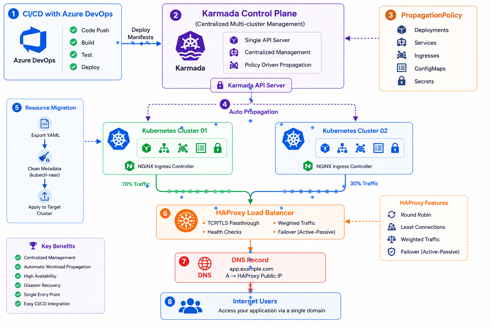

# 🚀 Karmada Multi-Cluster Kubernetes Deployment with HAProxy

A production-style **multi-cluster Kubernetes deployment** using **Karmada** to centrally manage multiple Kubernetes clusters and automatically distribute Kubernetes resources such as **Deployments, Services, Ingresses, Secrets, and ConfigMaps**.

This project demonstrates how to build a centralized control plane that manages multiple Kubernetes clusters while exposing applications through a single **HAProxy Load Balancer**.

---

# 📌 Project Overview

Karmada provides a single control plane to manage multiple Kubernetes clusters.

In this project I configured:

- ✅ Karmada Control Plane
- ✅ Two Kubernetes member clusters
- ✅ Cluster registration (Join Clusters)
- ✅ Resource propagation using PropagationPolicy
- ✅ Automatic deployment distribution
- ✅ HAProxy Load Balancer
- ✅ Centralized application management

The control plane distributes workloads across both Kubernetes clusters while HAProxy exposes them through a single public endpoint.

---

# 🏗 Architecture

---

# 🚀 Features

- Multi-cluster Kubernetes management
- Centralized Karmada Control Plane
- Cluster Join & Unjoin
- Resource Propagation
- Deployment Synchronization
- Service Synchronization
- Ingress Synchronization
- Secret Synchronization
- ConfigMap Synchronization
- HAProxy TCP/TLS Passthrough
- High Availability Architecture
- Azure DevOps Ready

---

# 🛠 Technologies Used

- Kubernetes
- Karmada v1.15.1
- K3s
- HAProxy
- Docker
- kubectl
- karmadactl
- NGINX Ingress Controller
- Azure DevOps

---

# 📂 Resources Distributed

The following Kubernetes resources are automatically propagated to both clusters:

- Deployment
- Service
- Ingress
- ConfigMap
- Secret

using **PropagationPolicy**.

---

# 📋 Project Workflow

### 1. Create Karmada Control Plane

- Install K3s
- Install Karmada
- Configure kubeconfig
- Verify API server

---

### 2. Register Member Clusters

Join both Kubernetes clusters using:

- karmadactl join

After joining, Karmada manages both clusters from a single control plane.

---

### 3. Configure Propagation Policy

A PropagationPolicy is created to automatically distribute resources to both clusters.

Resources included:

- Deployment
- Service
- Ingress
- ConfigMap
- Secret

Whenever these resources are created on Karmada, they are automatically synchronized across all member clusters.

---

### 4. HAProxy Load Balancer

A standalone HAProxy server sits in front of both Kubernetes clusters.

Responsibilities:

- Single Public IP
- TCP/TLS Passthrough
- Health Checks
- Active-Active Load Balancing
- Active-Passive Failover
- Weighted Traffic Distribution

Supported modes:

- Round Robin
- Least Connection
- Weighted Distribution
- Backup Server (Failover)

---

# 🎯 What I Have Worked

During this project I gained hands-on experience with:

- Multi-cluster Kubernetes architecture
- Karmada installation and configuration
- Joining and removing Kubernetes clusters
- Resource propagation
- High Availability design
- HAProxy Layer-4 Load Balancing
- Multi-cluster application deployment
- Kubernetes networking
- Ingress management
- Centralized cluster administration

---

# 💡 Real-world Use Cases

- Multi-region Kubernetes
- Disaster Recovery
- High Availability
- Blue-Green Deployments
- Centralized Cluster Management
- Hybrid Cloud
- Edge Computing

---

# 📖 Documentation

A complete step-by-step deployment guide is included in this repository.

| Guide | Description |
|-------|-------------|
| [Installation](docs/installation.md) | Install Docker, kubectl, K3s and Karmada |
| [Join Clusters](docs/cluster-join.md) | Register Kubernetes clusters |
| [Propagation Policy](docs/propagation-policy.md) | Distribute workloads |
| [Karmada Configuration](docs/karmada-configuration.md) | Move workloads between clusters |
| [HAProxy](docs/haproxy.md) | Configure Load Balancer |

---

# 👨‍💻 Author

**Noushad Hasan**

DevOps Engineer | Kubernetes | Docker | Terraform | Jenkins | GitOps | Ansible | Azure DevOps

---

⭐ If you found this project useful, consider giving it a Star.
