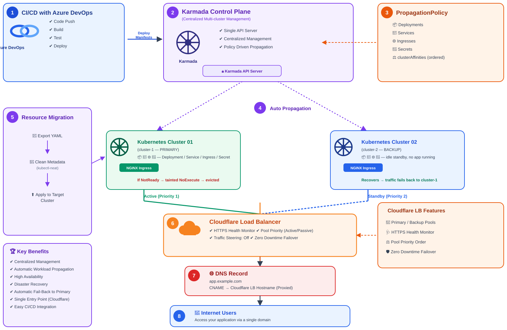

# Karmada Multi-Cluster Kubernetes Deployment with Active/Passive Failover

A production-style **multi-cluster Kubernetes deployment** using **Karmada** to centrally manage multiple Kubernetes clusters and automatically distribute Kubernetes resources such as **Deployments, Services, Ingresses, Secrets, and ConfigMaps**.

This project demonstrates how to build a centralized control plane that manages multiple Kubernetes clusters, fails workloads over automatically between clusters using Karmada's `ClusterAffinities` and `ClusterTaintPolicy`, and exposes applications through either a self-hosted **HAProxy Load Balancer** or a **Cloudflare Load Balancer**.

---

# 📌 Project Overview

Karmada provides a single control plane to manage multiple Kubernetes clusters.

In this project I configured:

- ✅ Karmada Control Plane
- ✅ Two Kubernetes member clusters
- ✅ Cluster registration (Join Clusters)
- ✅ Resource propagation using PropagationPolicy
- ✅ Active/Passive failover using ClusterAffinities
- ✅ Automatic cluster health tainting using ClusterTaintPolicy
- ✅ Production failover hardening (controller-manager feature gates, automatic fail-back)
- ✅ Automatic deployment distribution
- ✅ HAProxy Load Balancer
- ✅ Cloudflare Load Balancer (Active/Passive pool failover)
- ✅ Centralized application management

The control plane distributes workloads across both Kubernetes clusters, automatically failing them over to the standby cluster if the primary becomes unhealthy, while HAProxy or Cloudflare exposes them through a single public endpoint.

---

# 🏗 Architecture

> This replaces the earlier `karmada-haproxy-blog-architecture.gif`, which only showed the original 70/30 weighted HAProxy split — it predates the `ClusterAffinities` / `ClusterTaintPolicy` active/passive failover and Cloudflare Load Balancer option documented below. The old file is still in the repo root if you want to compare or reuse it.

---

# 🚀 Features

- Multi-cluster Kubernetes management
- Centralized Karmada Control Plane
- Cluster Join & Unjoin
- Resource Propagation
- Deployment Synchronization
- Service Synchronization
- Ingress Synchronization
- Secret Synchronization
- ConfigMap Synchronization
- Active/Passive failover with `ClusterAffinities`
- Automatic unhealthy-cluster tainting with `ClusterTaintPolicy`
- HAProxy TCP/TLS Passthrough
- Cloudflare Load Balancer (Primary/Backup pools, HTTPS health monitor)
- High Availability Architecture
- Azure DevOps Ready

---

# 🛠 Technologies Used

- Kubernetes
- Karmada v1.18.0
- K3s
- HAProxy
- Cloudflare Load Balancer
- Docker
- kubectl
- karmadactl
- NGINX Ingress Controller
- Azure DevOps

---

# 📂 Resources Distributed

The following Kubernetes resources are automatically propagated by Karmada, running on whichever cluster is currently active per the `ClusterAffinities` failover chain:

- Deployment
- Service
- Ingress
- ConfigMap
- Secret

using **PropagationPolicy**.

---

# 📋 Project Workflow

### 1. Create Karmada Control Plane

- Install K3s
- Install Karmada
- Configure kubeconfig
- Verify API server

---

### 2. Register Member Clusters

Join both Kubernetes clusters using:

- karmadactl join

After joining, Karmada manages both clusters from a single control plane.

---

### 3. Configure Propagation Policy

A PropagationPolicy is created to automatically distribute resources to both clusters.

Resources included:

- Deployment
- Service
- Ingress
- ConfigMap
- Secret

Whenever these resources are created on Karmada, they are automatically synchronized across all member clusters.

---

### 4. Active/Passive Failover (ClusterAffinities + ClusterTaintPolicy)

Instead of scheduling to both clusters at once, the PropagationPolicy uses `placement.clusterAffinities` to define an ordered failover chain:

- `cluster-1` is scheduled first as the **Primary**.
- `cluster-2` is only used as the **Backup** once the primary stops satisfying placement.

A companion `ClusterTaintPolicy` watches each member cluster's `Ready` condition and automatically:

- Taints a cluster as `failover.karmada.io/unhealthy` (`NoExecute`) when it goes unhealthy, evicting workloads from it.
- Removes the taint once the cluster recovers.

Together these drive automatic, unattended failover between clusters — no manual intervention required.

---

### 5. Load Balancer / Traffic Exposure

Two options are documented for exposing the active cluster to the internet:

- **HAProxy** — a standalone Layer-4 (TCP/TLS passthrough) load balancer you run yourself, sitting in front of both cluster ingress IPs.
- **Cloudflare Load Balancer** — a managed Layer-7 load balancer using Primary/Backup pools, pool priority, and an HTTPS health monitor to steer traffic to whichever cluster Karmada currently has the application running on.

#### HAProxy Load Balancer

A standalone HAProxy server sits in front of both Kubernetes clusters.

Responsibilities:

- Single Public IP
- TCP/TLS Passthrough
- Health Checks
- Active-Active Load Balancing
- Active-Passive Failover
- Weighted Traffic Distribution

Supported modes:

- Round Robin
- Least Connection
- Weighted Distribution
- Backup Server (Failover)

#### Cloudflare Load Balancer

As an alternative to self-hosted HAProxy, Cloudflare's Load Balancer can front the two clusters directly:

- **Primary Pool** (`Cluster-1-POOL`) and **Backup Pool** (`Cluster-2-POOL`), each pointing at one cluster's Ingress public IP on port 443.
- **Traffic Steering: Off**, so Cloudflare uses pool priority order (Primary → Backup) rather than latency/geo-based steering.
- An **HTTPS health monitor** (not just TCP) checking `/health` or `/healthz` with an expected `200` response, so failover reacts to application health, not just port reachability.
- **Zero Downtime Failover** enabled to retry failed requests against the next healthy pool.

Full failover flow: Karmada detects the primary cluster is down → `ClusterTaintPolicy` taints it → workloads are rescheduled to `cluster-2` → the app becomes healthy there → the Cloudflare HTTPS monitor marks the backup pool healthy → traffic moves to `cluster-2`.

See [Cloudflare Load Balancer Configuration](docs/cloudflare-karmada-lb.md) for the full pool, monitor, and DNS setup.

---

# 🎯 What I Have Worked

During this project I gained hands-on experience with:

- Multi-cluster Kubernetes architecture
- Karmada installation and configuration
- Joining and removing Kubernetes clusters
- Resource propagation
- Active/Passive failover with ClusterAffinities and ClusterTaintPolicy
- High Availability design
- HAProxy Layer-4 Load Balancing
- Cloudflare Layer-7 Load Balancing and pool/health-monitor configuration
- Multi-cluster application deployment
- Kubernetes networking
- Ingress management
- Centralized cluster administration

---

# 💡 Real-world Use Cases

- Multi-region Kubernetes
- Disaster Recovery
- High Availability
- Blue-Green Deployments
- Centralized Cluster Management
- Hybrid Cloud
- Edge Computing

---

# 📖 Documentation

A complete step-by-step deployment guide is included in this repository.

| Guide | Description |
|-------|-------------|
| [Installation](docs/installation.md) | Install Docker, kubectl, K3s and Karmada |
| [Join Clusters](docs/cluster-join.md) | Register Kubernetes clusters |
| [Production Failover Hardening](docs/production-failover-hardening.md) | PropagationPolicy, ClusterTaintPolicy, controller-manager failover feature gates, rollout deadlock fix, automatic fail-back CronJob, manual drills |
| [Karmada Configuration](docs/karmada-configuration.md) | Move workloads between clusters |
| [HAProxy](docs/haproxy.md) | Configure self-hosted Load Balancer |
| [Cloudflare Load Balancer](docs/cloudflare-karmada-lb.md) | Configure managed Active/Passive Load Balancer |
| [Cloudflare LB Pool Setup](docs/cloudflare-lb-pool-setup.md) | Step-by-step dashboard walkthrough for the Pools wizard |

---

# 👨‍💻 Author

**Noushad Hasan**

DevOps Engineer | Kubernetes | Docker | Terraform | Jenkins | GitOps | Ansible | Azure DevOps

---

⭐ If you found this project useful, consider giving it a Star.
