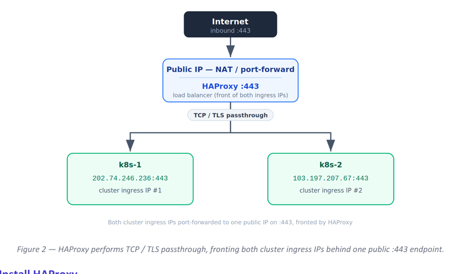

# HAProxy Load Balancer
Both clusters' ingress (LoadBalancer) IPs are port-forwarded to a single public IP on port 443. A 
standalone HAProxy instance sits in front of those two ingress IPs and is the public entry point for all 
HTTPS traffic. 



# Install HAProxy 
```bash
sudo apt update 
sudo apt install -y haproxy 
```
* Edit the haproxy configuration file:
Append the following to /etc/haproxy/haproxy.cfg
```bash
global 
log /dev/log local0 
user haproxy 
group haproxy 
daemon 
maxconn 50000 
ssl-server-verify none 
defaults 
log global 
mode tcp 
option tcplog 
timeout connect 5s 
Page 9 of 11 
Karmada Install & Configuration HAProxy Load Balancer 
Page 10 of 11 
    timeout client  300s 
    timeout server  300s 
 
frontend https_front 
    bind 0.0.0.0:443 
    mode tcp 
    tcp-request inspect-delay 5s 
    tcp-request content accept if { req_ssl_hello_type 1 } 
    default_backend k8s_https_backend 
 
backend k8s_https_backend 
    mode tcp 
    option tcp-check 
    server worker-1 <Load balancer ip>:443 check inter 3s fall 3 rise 2 
    server worker-2 <Load balancer ip>:443 check inter 3s fall 3 rise 2 backup 
 
listen stats 
    bind *:8404 
    mode http 
    stats enable 
    stats uri /stats 
    stats refresh 5s 
```
# Validate and restart 
```bash
sudo haproxy -c -f /etc/haproxy/haproxy.cfg 
 
sudo systemctl restart haproxy 
sudo systemctl status haproxy
```

# Optional — Choosing a Distribution Method
Pick one backend variant depending on whether you want failover, weighted, or balanced traffic across 
the two cluster ingresses.

*  Active-active, equal (recommended for same-cluster ingress) 
```bash
backend k8s_https_backend 
    mode tcp 
    balance roundrobin            # or: balance leastconn 
    option tcp-check 
    server worker-1 <Load balancer ip>:443 check inter 3s fall 3 rise 2 
    server worker-2 <Load balancer ip>:443 check inter 3s fall 3 rise 2 
```
* Active-active, weighted (e.g. 70 / 30 if worker-1 is larger) 
```bash
backend k8s_https_backend 
    mode tcp 
    balance roundrobin 
    option tcp-check 
    server worker-1 <Load balancer ip>:443 weight 70 check inter 3s fall 3 rise 2 
    server worker-2 <Load balancer ip>:443 weight 30 check inter 3s fall 3 rise 2
```
* Failover / active-passive (worker-2 is a hot standby) 
```bash
backend k8s_https_backend 
    mode tcp 
    option tcp-check 
    server worker-1 <Load balancer ip>:443 check inter 3s fall 3 rise 2 
    server worker-2 <Load balancer ip>:443 check inter 3s fall 3 rise 2 backup 
```